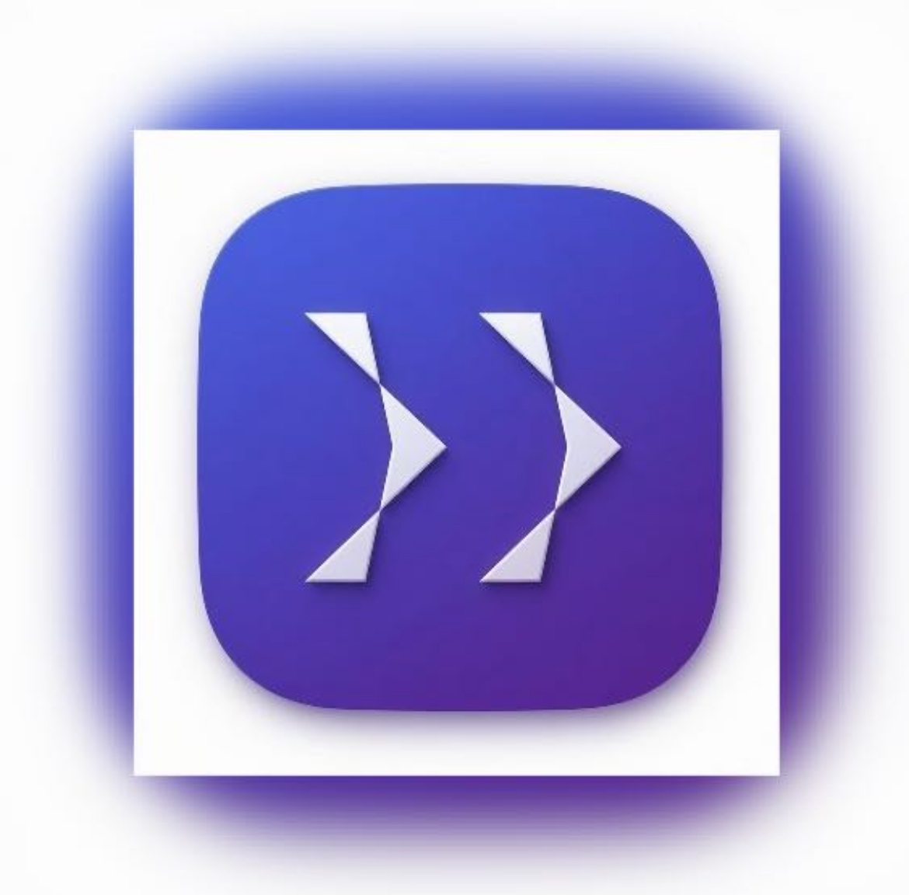
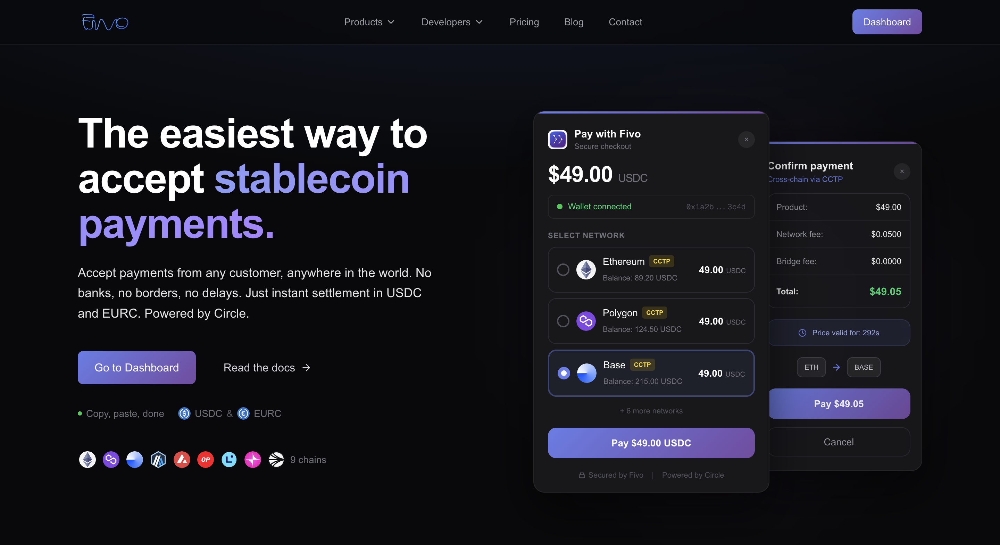
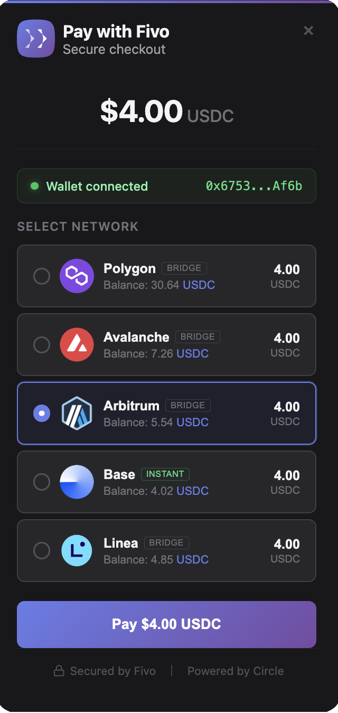
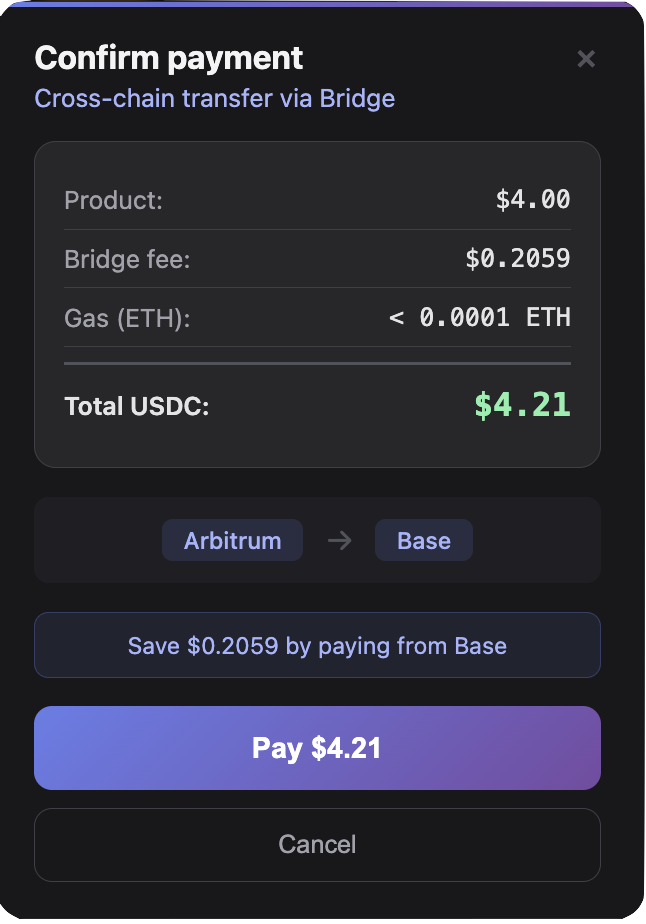
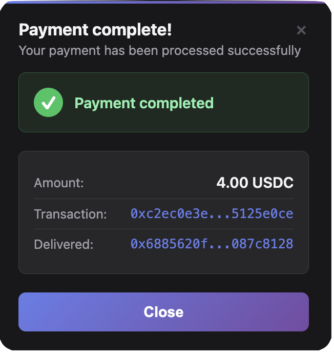
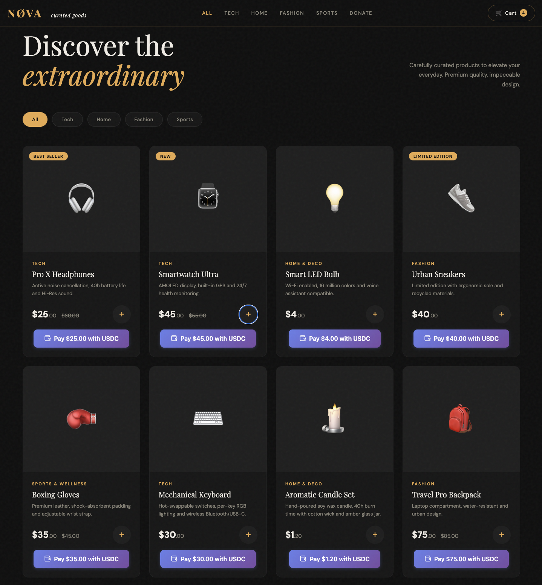
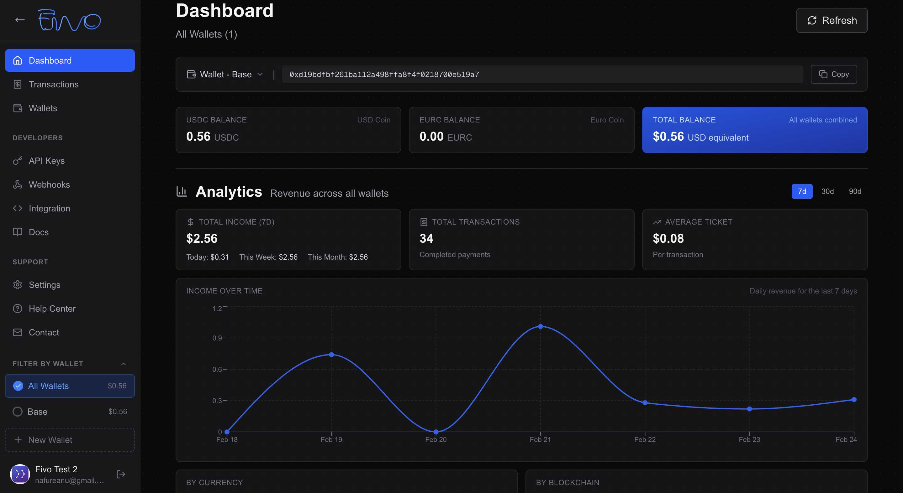

<div align="center">



# Fivo

**The easiest way to accept stablecoin payments.**

[](https://fivo.finance)
[](https://www.circle.com/)
[](https://fivo.finance/chains)
[](#)

Accept USDC and EURC on your website with a single line of code. No banks, no borders, no delays.

[Website](https://fivo.finance) | [Documentation](https://fivo.finance/docs) | [Quick Start](https://fivo.finance/docs/quickstart) | [Contact](https://fivo.finance/contact)



</div>

---

## What is Fivo?

Fivo is a stablecoin payment gateway that lets merchants accept USDC and EURC payments across 9 blockchain networks with instant settlement.

Built on [Circle](https://www.circle.com/) infrastructure (Programmable Wallets + [Bridge Kit SDK](https://developers.circle.com/w3s/bridge-kit-sdk)), Fivo handles cross-chain bridging automatically. A customer can pay from any supported network and the merchant receives funds on their preferred chain.

## How It Works

<div align="center">
<table>
  <tr>
    <td align="center" width="33%">
      <strong>1. Select network</strong><br/><br/>
      <br/><br/>
      <sub>Customer picks any chain.<br/>Balances shown in real time.</sub>
    </td>
    <td align="center" width="33%">
      <strong>2. Confirm payment</strong><br/><br/>
      <br/><br/>
      <sub>Full fee breakdown.<br/>One-click confirmation.</sub>
    </td>
    <td align="center" width="33%">
      <strong>3. Done</strong><br/><br/>
      <br/><br/>
      <sub>Confirmed on-chain.<br/>Merchant receives instantly.</sub>
    </td>
  </tr>
</table>
</div>

## Integration

### Widget (recommended)

Add a single script tag to your website:

```html
<script
  src="https://checkout.fivo.finance/v1/fivo.js"
  data-merchant-id="your_merchant_id"
  data-amount="25.00"
  data-currency="USDC"
></script>
```

This renders a "Pay with Fivo" button that opens a checkout modal. The customer connects their wallet, selects a network, and pays. All without leaving your site.

<div align="center">

<br/><sub>Example: Fivo payment buttons integrated in a product catalog</sub>
</div>

<br/>

For variable amounts (donations, tips), omit the `data-amount` attribute and the customer enters the amount themselves.

### Checkout Sessions (API)

Create a payment session server-side and redirect your customer:

```bash
curl -X POST https://api.fivo.finance/checkout/sessions \
  -H "X-API-Key: your_api_key" \
  -H "Content-Type: application/json" \
  -d '{
    "amount": "25.00",
    "currency": "USDC",
    "return_url": "https://yoursite.com/success",
    "cancel_url": "https://yoursite.com/cancel"
  }'
```

### Direct API

For full control, use the REST API to build custom payment flows. See the [API Reference](https://fivo.finance/docs/api-reference).

## Cross-Chain Payments

Customers pay from any supported network. If the merchant's wallet is on a different chain, Fivo bridges the funds automatically via [Circle Bridge Kit](https://developers.circle.com/w3s/bridge-kit-sdk), with full fee transparency before confirmation.

Bridge Kit handles the entire cross-chain flow (approve, burn, attestation, mint) in a single transaction from the customer's perspective. No intermediate wallets, no manual steps.

## Merchant Dashboard

Track payments in real time, manage wallets across chains, configure webhooks, issue refunds, and withdraw funds with automatic invoice generation.

<div align="center">

</div>

## Supported Networks

| Network | USDC | EURC | Cross-Chain |
|---------|------|------|-------------|
| Ethereum | Yes | Yes | Bridge |
| Polygon | Yes | Yes | Bridge |
| Avalanche | Yes | Yes | Bridge |
| Arbitrum | Yes | Yes | Bridge |
| Base | Yes | Yes | Instant |
| Optimism | Yes | Yes | Bridge |
| Linea | Yes | No | Bridge |
| Unichain | Yes | No | Bridge |
| Sonic | Yes | No | Bridge |

The merchant receives on their chosen network regardless of which chain the customer pays from.

## Key Features

- **Multi-chain.** 9 EVM networks, one integration
- **Cross-chain bridging.** Automatic via Circle Bridge Kit
- **Stablecoins only.** USDC and EURC, no volatility
- **Instant settlement.** Funds arrive in your wallet, not a bank account
- **Refunds.** On-chain refund execution with receipt PDF
- **Invoicing.** Automatic invoice per withdrawal with PDF generation
- **Webhooks.** HMAC-SHA256 signed, real-time payment notifications
- **Enterprise security.** 2FA, API key management, audit trail

## Pricing

- **No monthly fees**
- **No setup costs**
- **0.5% fee on withdrawals only**
- Free account creation in 30 seconds

## Built With

- [Circle Programmable Wallets](https://www.circle.com/en/programmable-wallets). Secure wallet infrastructure
- [Circle Bridge Kit SDK](https://developers.circle.com/w3s/bridge-kit-sdk). Cross-chain USDC/EURC transfers
- [USDC](https://www.circle.com/en/usdc). Fully reserved, regulated stablecoin
- [EURC](https://www.circle.com/en/eurc). Euro-backed stablecoin by Circle

## Links

- [Website](https://fivo.finance)
- [Dashboard](https://fivo.finance/login)
- [Documentation](https://fivo.finance/docs)
- [Quick Start Guide](https://fivo.finance/docs/quickstart)
- [API Reference](https://fivo.finance/docs/api-reference)
- [Contact](https://fivo.finance/contact)

---

Copyright 2025-2026 Fivo. All rights reserved.
